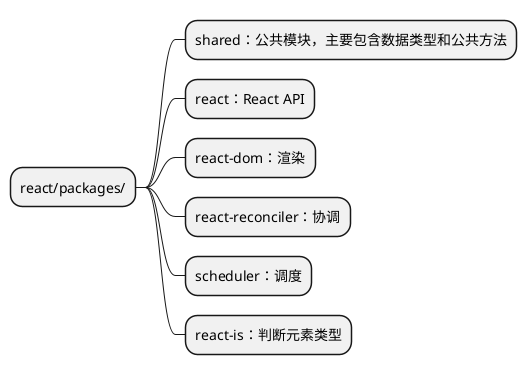

# React 源码

源码大纲导读：

```plantuml
@startmindmap
skinparam monochrome true

+ react/packages/
++ shared：公共模块，主要包含数据类型和公共方法
++ react：React API
++ react-dom：渲染
++ react-reconciler：协调
++ scheduler：调度
++ react-is：判断元素类型

@endmindmap
```
